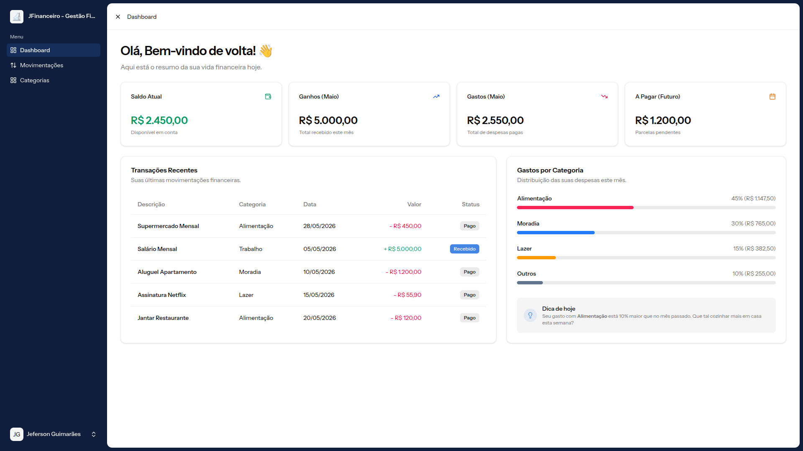
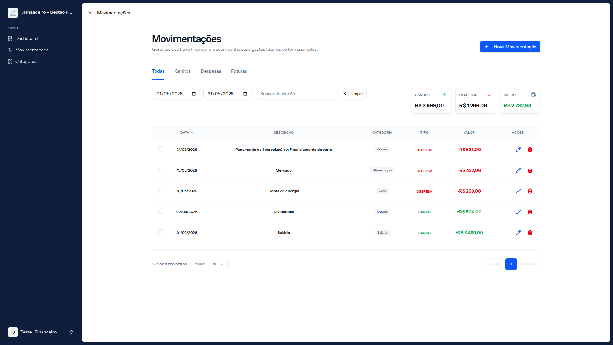
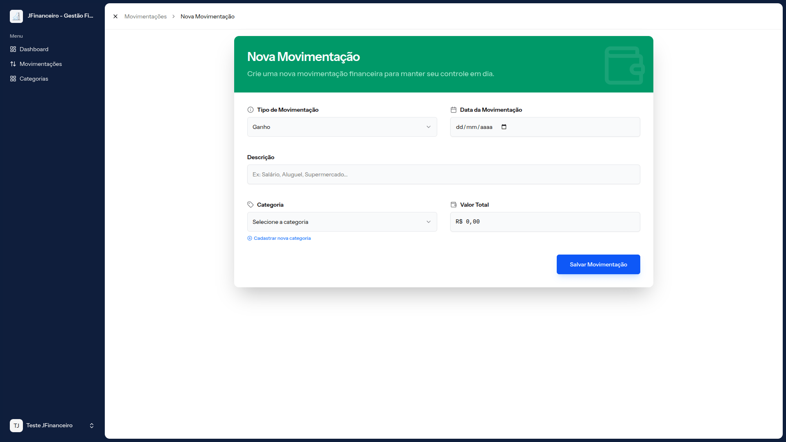

<p align="center">
  
</p>

# JFinanceiro 💰

Sistema web para controle financeiro pessoal com foco em organização financeira, planejamento de despesas futuras e previsibilidade de saldo.

🌐 **Produção:** https://jfinanceiro.com.br

---

## Sobre o Projeto

O JFinanceiro é uma aplicação web desenvolvida para ajudar pessoas que desejam ter maior controle sobre sua vida financeira, registrando ganhos, despesas e compromissos futuros de forma simples e intuitiva.

O principal diferencial do sistema é a gestão de movimentações futuras, permitindo que o usuário visualize antecipadamente o impacto financeiro das contas que ainda serão pagas.

O projeto surgiu a partir da reescrita completa de um sistema legado desenvolvido originalmente em PHP puro, sendo reconstruído utilizando tecnologias modernas e boas práticas de desenvolvimento de software.

---

<p align="center">
  
  
  
  
</p>

## Funcionalidades

### 💵 Controle Financeiro

- Cadastro de ganhos
- Cadastro de despesas
- Cadastro de gastos futuros
- Controle de parcelas
- Pagamento individual de parcelas
- Pagamento em massa de parcelas
- Histórico completo de movimentações
- Edição de movimentações
- Exclusão de movimentações

### 📂 Organização

- Cadastro de categorias personalizadas
- Classificação por tipo de movimentação
- Filtros de pesquisa
- Visualização simplificada das movimentações

### 📈 Planejamento Financeiro

- Controle de contas futuras
- Acompanhamento de parcelas pendentes
- Dashboard com indicadores financeiros
- Resumo financeiro mensal

### 🔒 Segurança

- Autenticação de usuários
- Recuperação de senha
- Verificação de e-mail
- Autenticação em dois fatores (2FA)

---

## Stack Tecnológica

### Backend

- PHP 8+
- Laravel
- Eloquent ORM
- MySQL
- Migrations
- Seeders

### Frontend

- Vue.js 3
- Inertia.js
- TypeScript
- Tailwind CSS
- Shadcn Vue

### Qualidade e Ferramentas

- PHPUnit
- Vite
- Git
- GitHub
- Git flow
- CI/CD

---

## Arquitetura

O projeto utiliza uma arquitetura monolítica moderna baseada em Laravel + Vue.js através do Inertia.js.

Essa abordagem proporciona:

- Menor complexidade arquitetural
- Maior produtividade
- Melhor integração entre frontend e backend
- Facilidade de manutenção
- Evolução simplificada do produto

---

## Qualidade de Código

O desenvolvimento segue princípios e práticas como:

- SOLID
- Clean Code
- Separação de responsabilidades
- Testes automatizados
- Validações centralizadas
- Boas práticas do ecossistema Laravel

---

## Testes Automatizados

O sistema possui cobertura para regras de negócio críticas, incluindo:

- Cadastro de movimentações
- Cadastro de gastos futuros
- Pagamento de parcelas
- Exclusão de movimentações
- Validações de formulários
- Regras financeiras

### Executando os testes

```bash
php artisan test
```

---

## Executando o Projeto Localmente

```bash
# Clonar o repositório
git clone https://github.com/jeferson-guimaraes/jfinanceiro.git

# Entrar no projeto
cd jfinanceiro

# Instalar dependências PHP
composer install

# Instalar dependências JavaScript
npm install

# Configurar ambiente
cp .env.example .env

php artisan key:generate

# Executar migrations
php artisan migrate

# Iniciar aplicação
php artisan serve
npm run dev
```

---

## Screenshots

### Dashboard



### Movimentações



### Cadastro de Movimentação



---

## Roadmap

Próximas funcionalidades planejadas:

- [ ] Notificações de contas próximas ao vencimento
- [ ] Progressive Web App (PWA)
- [ ] Push Notifications
- [ ] Relatórios avançados
- [ ] Exportação de dados

---

## Demonstração

Acesse a versão em produção:

👉 **https://jfinanceiro.com.br**

---

## Desenvolvedor

Desenvolvido por **Jeferson Guimarães**.

🌐 Portfólio: https://jeferson-guimaraes.github.io/portfolio/

💻 GitHub: https://github.com/jeferson-guimaraes